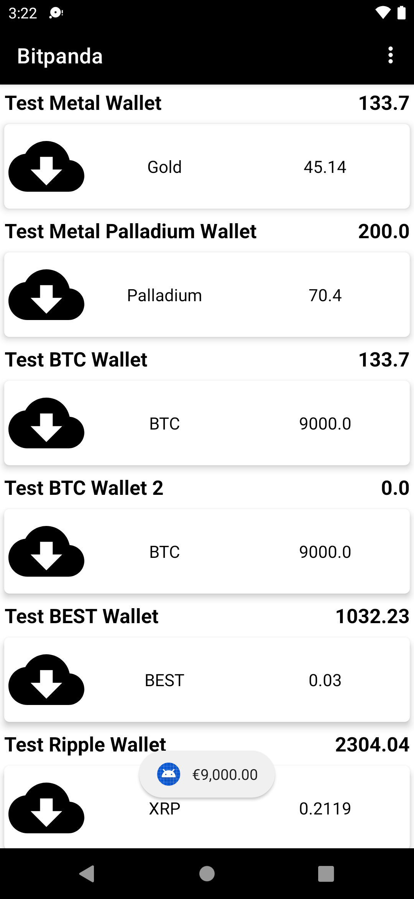
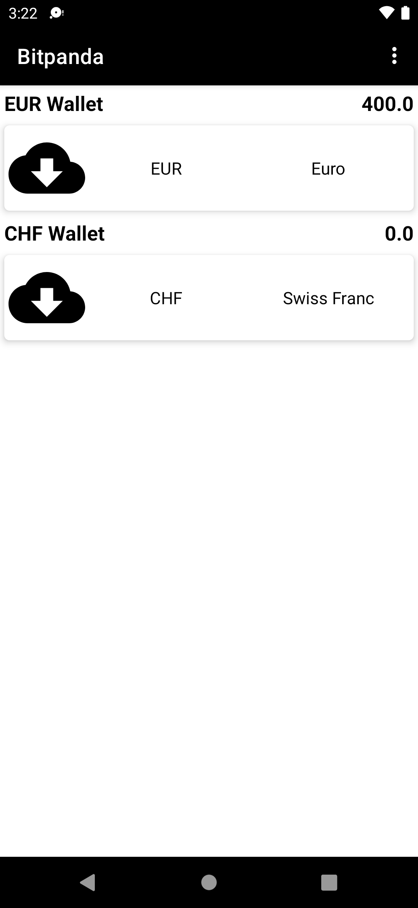

## Table of Contents

- [Architecture](#architecture)
- [Libraries](#libraries)
- [Screenshots](#screenshots)

## Architecture

the application is expected to scale with multiple developers working on it,
I used the Clean architectural principles to build the application.
I choose this architecture because it offers better separation of concerns and testability.

The Application is split into a three layer architecture:
- Data
- Domain
- Presentation

### Communication between layers
1. UI calls method from ViewModel.
2. ViewModel executes Use case.
3. Use case executes one or multiple Repositories function.
4. The Repository returns data from one or multiple Data Sources. the repository is the single source of truth
5. Information flows back to the UI where we display the data fetched from data sources.

this diagram show the flow of the data between the each layer.

This provides better abstractions between framework implementations and the underlying business logic.
It requires a number of classes to get things running but the pros outweigh the cons in terms of building an app that should scale.
The 3 layered architectural approach is majorly guided by clean architecture which provides a clear separation of concerns with its Abstraction Principle.

#### Presentation

I used the MVVM pattern for the presentation layer. The Model essentially exposes
the various states the view can be in. The ViewModel handles the UI logic and provides
data via Android architectural component StateFlow to the view. The ViewModel talks to
the domain layer with the individual use cases.

#### Domain

The domain layer contains the application specifics logic. It contains
use cases that expose the actions that can be performed in the application.

The UseCases use a `MainUseCase` interface that defines the parameters its taking in and
output and also handles running the UseCases in a background thread leveraging Kotlin Coroutines.

#### Data

The data layer handles the business logic and provides data from the API.
This layer uses the Repository pattern to fetch data from various data sources which in
this case is the Remote API.

 
## Libraries

Libraries used in the whole application are:

- [Jetpack](https://developer.android.com/jetpack)🚀
  - [Viewmodel](https://developer.android.com/topic/libraries/architecture/viewmodel) -Store and manage UI related data in a lifecycle conscious way and act as a channel between use cases and ui
  - [View Binding](https://developer.android.com/topic/libraries/view-binding) - support library that allows binding of UI components,view Binding replaces findViewById.
- [Retrofit](https://square.github.io/retrofit/) - type safe http client and supports coroutines out of the box.  
- [okhttp-logging-interceptor](https://github.com/square/okhttp/blob/master/okhttp-logging-interceptor/README.md) - logs HTTP request and response data.
- [RXJava](https://github.com/ReactiveX/RxAndroid) - enabling Reactive Programming in Android
- [Material Design](https://material.io/develop/android/docs/getting-started/) - build awesome beautiful UIs.
- [Dagger](https://developer.android.com/training/dependency-injection) - A pragmatic lightweight dependency injection framework for Kotlin

## Screenshots

  
  

a. Let us know about some Apps that are currently out on the market, where you think they did a good job in development and justify your choice.

Fitness Challenge Apps - Workout at Home by Leap Fitness GroupHealth and MEGA by Mega Ltd.
What I like about these apps is it very user friendly which maybe one of the reasons for
users retention. They provide easy to use features by not overloading the users with tons
of complex features and have simple but captivating design. The simplicity and cool features
definitely make them worth it.

b. How would you handle this situation?
The Product Owner comes over to you and asks for an implementation with which he can see the performance of his crypto wallet over the past weeks. He is an iOS user and doesn't know the Android
platform too well. How would you approach this task?

For this task, I will first have a discussion with Product owner where I will try to
understand all the requirements. I would reiterate the task and its requirements to I have
understood everything correctly. Then I will give a brief overview of the confirm if way I am
thinking of solving this with performance in mind from android perspective and then later I will
dig deep to research and find out all the possible ways of implementation and also decide on the
criteria. After this I will weigh in the pros and cons of each method of implementation
according to the criteria I defined earlier and select my best option. Then I will present
all my findings to them and lastly inform them about my choice and its justification. Then we will
discuss and choose the best fitting method. I will also follow the recommended solution of
using Material Design guidelines for the app to operate consistently. I will have a brief
discussion plan and design everything before I start. After implementing the first draft, I will
demonstrate it and after approval I will go on to final finishes.

c. What kind of (technical) projects do you work on in your spare time?
https://play.google.com/store/apps/details?id=com.namshi.android
https://play.google.com/store/apps/details?id=com.itmobix.ksaendeals
https://play.google.com/store/apps/details?id=com.wajibaty.study
https://play.google.com/store/apps/details?id=amrmustafa.whocalled
